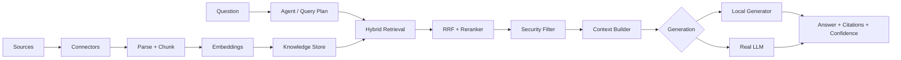

# Architecture overview

## Core boundaries

### Ingestion

Connectors produce `RawItem` records. Parsing and chunking create retrieval-ready `Chunk` objects.

### Retrieval

Lexical, vector and symbol signals are independently computed and fused. Reranking happens after fusion.

### Agent

The agent plans retrieval and delegates knowledge operations to explicit tools.

### Generation

Generation is a replaceable provider. Local mode is the safe default; real providers are optional.

### Trust

Sensitivity filtering and bounded context happen before generation. Evidence and confidence are returned alongside the answer.
